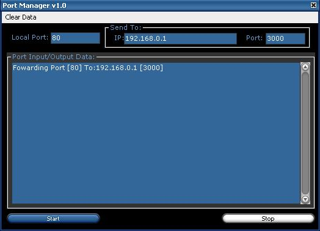



## Port Fowarding

### Description

This is a very simple program I put together that allows you to re-direct a port from one machine to another. It is very simple to use, and the code is very easy to understand.
 
### More Info
 
This is my first code for this site. Please RATE is....

             |
---                |---
**Submitted On**   |2004-03-08 10:15:52
**By**             |[Mitchell Kinard](https://github.com/Planet-Source-Code/PSCIndex/blob/master/ByAuthor/mitchell-kinard.md)
**Level**          |Beginner
**User Rating**    |5.0 (10 globes from 2 users)
**Compatibility**  |VB 6\.0
**Category**       |[Internet/ HTML](https://github.com/Planet-Source-Code/PSCIndex/blob/master/ByCategory/internet-html__1-34.md)
**World**          |[Visual Basic](https://github.com/Planet-Source-Code/PSCIndex/blob/master/ByWorld/visual-basic.md)
**Archive File**   |[Port\_Fowar171768382004\.zip](https://github.com/Planet-Source-Code/mitchell-kinard-port-fowarding__1-52227/archive/master.zip)

